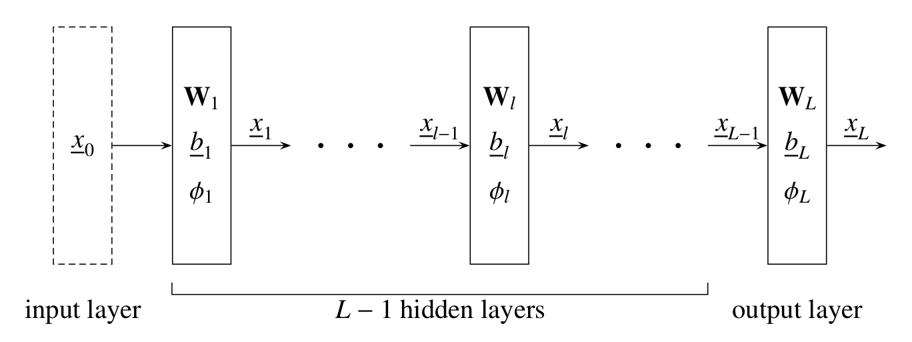
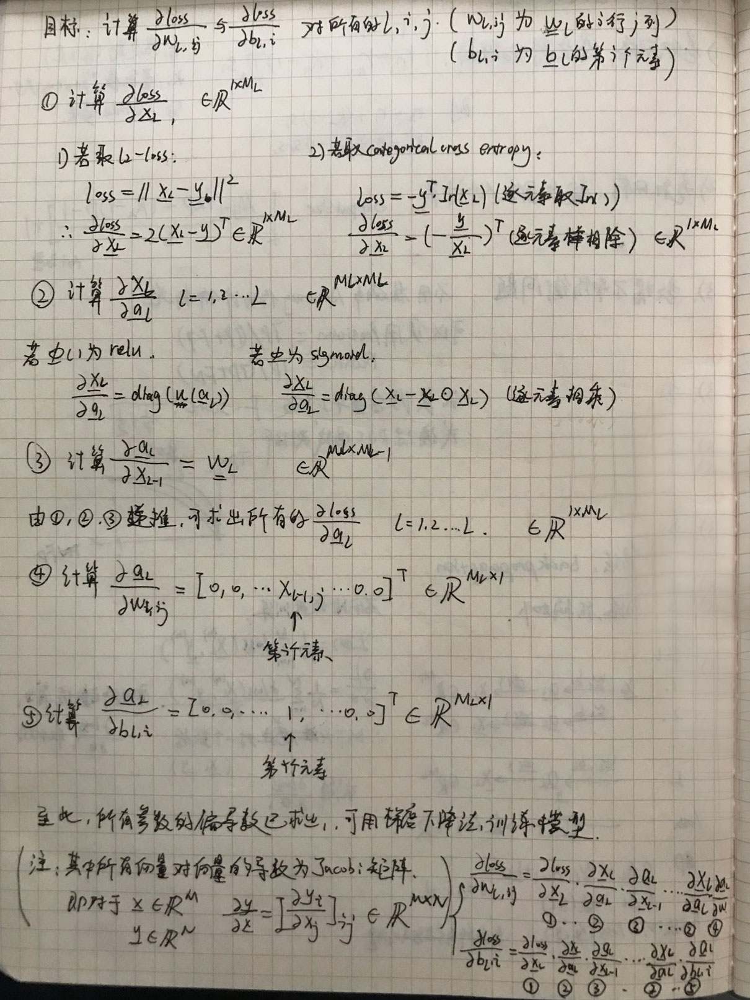

# Fully Connected Neural Networks

## Model Architecture

## Activation Functions

1. Linear (identity):

$$
\phi(a) = a
$$
2. Unit step:

$$
\phi(a) = u(a) = \begin{cases} 
     1 &a\ge0  
\\\\ 0 &a<0  
\end{cases}
$$

3. Sign Function:

$$
\phi(a) = sign(a) = \begin{cases} 
     1 &a\ge0  
\\\\ -1 &a<0  
\end{cases} = 2u(a)-1
$$

4. Sigmoid:

$$
\phi(a) = \sigma(a) = \frac{1}{1+e^{-a}} \\\\
\frac{d\phi}{da} = \phi(a)[1-\phi(a)]
$$

5. Hyperbolic tangent:

$$
\phi(a) = tanh(x) = \frac{e^a-e^{-a}}{e^a+e^{-a}} = 2\sigma(a)-1\\\\
$$

6. Rectifier linear unit (ReLU):

$$
\phi(a) = ReLU(a) = max(a,0) = \begin{cases} 
     a &a\ge0  
\\\\ 0 &a<0  
\end{cases}
$$

7. Softplus (a smooth approximation to ReLU):

$$
\phi(a) = ln(1+e^a)
$$

8. Leaky ReLU (non-zero gradient for a<0):

$$
\phi(a) = \begin{cases} 
     a &a\ge0  
\\\\ 0.001a &a<0  
\end{cases}
$$

9. Exponential linear unit (ELU) (non-zero gradient for a<0):

$$
\phi(a) = \begin{cases} 
     a &a\ge0  
\\\\ a(e^a-1) &a<0  
\end{cases}
$$

10. Softmax:

$$
\phi_i(a) = \frac{e^{a_i}}{\sum_j e^{a_j}}, \quad 1 \le j \le c \\\\
\frac{\partial\phi_i(a)}{\partial a_j} = \begin{cases} 
     \phi_i(a)[1-\phi_i(a)] &i = j  
\\\\ -\phi_i(a)\phi_j(a) &i \ne j  
\end{cases}
$$

## Universal Approximation Theorem

The universal approximation theorem states that a feed-forward neural network with a linear output layer (φ L (a) = a) and

- at least one hidden layer with

- a nonlinear activation function

can approximate any continuous (nonlinear) function y (on compact input sets) to arbitrary accuracy.

Comments:

- arbitrary accuracy: with an increasing number of hidden neurons.
- valid for a wide range of nonlinear activation functions, but excluding polynomials.
- minimum requirement for universal approximation: $W_2\phi_1(W_1x_0+b_1)+b_2$

## Loss

L2 loss (assuming true distribution y is estimation + white Gaussian noise):
$$
L(\theta)=\sum_{n=1}^N||y(n)-f(x(n);\theta)||^2
$$
L1 loss (assuming noise follows Laplace distribution):
$$
L(\theta)=\sum_{n=1}^N|y(n)-f(x(n);\theta)|
$$
Categorical cross entropy for classification:
$$
L(\theta)=\sum_{n=1}^N[-y^T(n)ln(f(x(n);\theta))]
$$

## Back Propagation

## Epoch and Mini-batch

