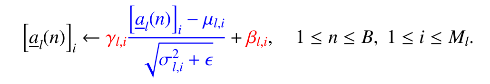
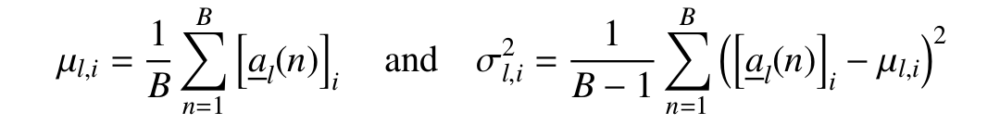

# Training Techniques

## Momentum

Use gradient part plus momentum part to update parameters
$$
\Delta\theta^t = \beta\Delta\theta^{t-1}-\gamma^t\nabla L(t;\theta)|_{\theta=\theta^t}
$$
$\beta \in [0,1)$ is the momentum factor, $\gamma^t$ is learning rate in t-th iteration.

- reduce noise in Stochastic gradient descent
- reduce oscillation and accelerate convergence for ill conditioned contour lines

Nesterov momentum:
$$
\Delta\theta^t = \beta\Delta\theta^{t-1}-\gamma^t\nabla L(t;\theta)|_{\theta=\theta^t+\beta\Delta\theta^{t-1}}
$$

## Adaptive schedules

- RMSprop
- Adam
- AdaGrad
- AdaDelta
- ...

## Batch Normalization

In layer l, $x_{l-1} \rightarrow a_{l-1} \overset{\phi}{\rightarrow} x_l$ , add learnable parameter $\gamma_L$ and $\beta_L$ , to avoid covariate shift over layers and over time during training

## Parameter Initialization

- bias vector: zero
- weight matrices: random or He Initialization

## Shortcut

skip connection, shortcut, residual network (ResNet)

- forward: make low level feature available in deep layers
- backward: avoid vanishing gradient