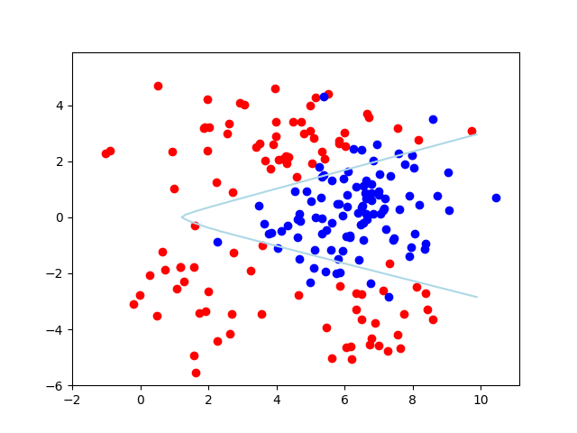

# Deep Neural Network from scratch - Classification

The neural network class. Add layer by given weight matrix, bias vector, as well as activation function. Model function calculates the forward chain, while gradient function 

```python
class NeuralNetwork:
    def add_dense_layer(self, n, activation=relu, d_activation=d_relu):
        self.Ws.append(np.random.normal(0., 2./self.dims[-1], [n, self.dims[-1]]))
        self.Bs.append(np.zeros([n, 1]))
        self.activations.append(activation)
        self.d_activations.append(d_activation)
        self.dims.append(n)
    def model(self, x0):
        x_temp = x0
        x = [x_temp]
        for i in range(len(self.Ws)):
            x_temp = self.activations[i](self.Ws[i].dot(x_temp) + self.Bs[i])
            x.append(x_temp)
        return x
    def gradient(self, xs, ys, d_loss_f):
        grad_w, grad_b = [], []
        for i in range(len(self.Ws)):
            grad_w.append(np.zeros(self.Ws[i].shape))
            grad_b.append(np.zeros(self.Bs[i].shape))
        for i in range(len(xs)):
            x = self.model(xs[i:i+1].T)  # (x, 1)
            y = ys[i:i+1].T  # (x, 1)
            index = -1
            jacobi = d_loss_f(x[index], y).dot(self.d_activations[index](x[index]))  # (1, x)*(x, x)
            while True:
                grad_w[index] += jacobi.T.dot(x[index-1].T)  # (x, 1)*(1, y)
                grad_b[index] += jacobi.T  # (x, 1)
                if index == -len(self.Ws):
                    break
                jacobi = jacobi.dot(self.Ws[index]).dot(self.d_activations[index-1](x[index-1]))  # (1, x)*(x, y)*(y, y)
                index -= 1
        for i in range(len(self.Ws)):
            grad_w[i] /= len(xs)
            grad_b[i] /= len(xs)
        return grad_w, grad_b
```

Generate non-linear separable dataset.

```python
def generate_data(n, p=0.8):
    # p: percentage of data for training
    x11 = np.random.multivariate_normal([4., 3.], [[4., 0.], [0., 1.]], int(0.5*n))
    x12 = np.random.multivariate_normal([2., -2.], [[1., 0.], [0., 2.]], int(0.25*n))
    x13 = np.random.multivariate_normal([7., -4.], [[1., 0.], [0., 1.]], int(0.25 * n))
    x1 = np.vstack((x11, x12, x13))
    plt.scatter(x1.T[0], x1.T[1], color="red")
    x2 = np.random.multivariate_normal([6., 0.], [[1.5, 0.5], [0.5, 1.5]], n)
    plt.scatter(x2.T[0], x2.T[1], color="blue")
    # combine data
    x = np.vstack((x1, x2))
    y = np.asarray([[1., 0.]] * n + [[0., 1.]] * n)
    # shuffle data
    shuffle_idx = np.arange(0, n*2)
    np.random.shuffle(shuffle_idx)
    x_shuffled = x[shuffle_idx]
    y_shuffled = y[shuffle_idx]
    # split data into training and testing
    _x_train = x_shuffled[0:int(n * p)*2]
    _y_train = y_shuffled[0:int(n * p)*2]
    _x_test = x_shuffled[int(n * p)*2:n*2]
    _y_test = y_shuffled[int(n * p)*2:n*2]
    return _x_train, _y_train, _x_test, _y_test
```

The architecture of neural network two hidden layers with 50 and 5 neurons. Sigmoid activation function for two hidden layers, and soft-max for the output layer:

```python
def sigmoid(_x):
    return 1. / (1. + np.exp(-_x))


def softmax(_x):
    return np.exp(_x) / np.sum(np.exp(_x))


def model(_x, _theta):
    """
    model architecture:
    input layer: m0 = 2
        theta["w1"]: (50, 2), theta["b1"]: (50, 1)
    hidden layer: m1 = 50, activation: sigmoid
        theta["w2"]: (5, 50), theta["b2"]: (5, 1)
    hidden layer: m2 = 5, activation: sigmoid
        theta["w3"]: (2, 5), theta["b3"]: (2, 1)
    output layer: m3 = 2, activation: soft-max
    """
    x0 = np.array(_x).reshape([2, 1])
    x1 = sigmoid(np.dot(_theta["w1"], x0) + _theta["b1"])
    x2 = sigmoid(np.dot(_theta["w2"], x1) + _theta["b2"])
    x3 = softmax(np.dot(_theta["w3"], x2) + _theta["b3"])
    return x0, x1, x2, x3
```

Back propagation for calculating the gradient vector:

```python
def gradient(_x, _y, _theta, _model):
    grad = {"w1": np.zeros([50, 2]), "b1": np.zeros([50, 1])
            , "w2": np.zeros([5, 50]), "b2": np.zeros([5, 1])
            , "w3": np.zeros([2, 5]), "b3": np.zeros([2, 1])}
    for i in range(len(_x)):
        x0, x1, x2, x3 = model(_x[i].reshape([2, 1]), _theta)
        # back propagation
        _loss_to_x3 = (-_y[i].reshape([2, 1]) / x3).T
        _x3_to_a3 = np.diag(x3.reshape([2, ])) - x3.dot(x3.T)
        _loss_to_a3 = _loss_to_x3.dot(_x3_to_a3)
        grad["w3"] += np.dot(_loss_to_a3.T, x2.T)
        grad["b3"] += _loss_to_a3.T
        _a3_to_x2 = _theta["w3"]
        _x2_to_a2 = np.diag((x2 - x2 * x2).reshape([5, ]))
        _loss_to_a2 = _loss_to_a3.dot(_a3_to_x2).dot(_x2_to_a2)
        grad["w2"] += np.dot(_loss_to_a2.T, x1.T)
        grad["b2"] += _loss_to_a2.T
        _a2_to_x1 = _theta["w2"]
        _x1_to_a1 = np.diag((x1 - x1 * x1).reshape([50, ]))
        _loss_to_a1 = _loss_to_a2.dot(_a2_to_x1).dot(_x1_to_a1)
        grad["w1"] += np.dot(_loss_to_a1.T, x0.T)
        grad["b1"] += _loss_to_a1.T
    return grad
```

Result:

