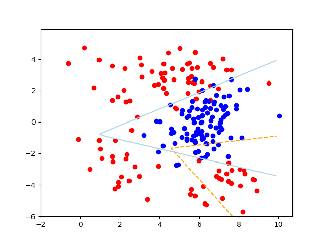
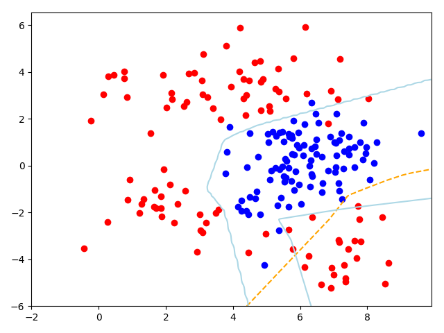

# Deep Neural Network in Pytorch

A network with 3 hidden layers, each contains 5 neurons.

```python
class Net(nn.Module):
    def __init__(self):
        super().__init__()
        self.fc1 = nn.Linear(2, 5)
        self.fc2 = nn.Linear(5, 5)
        self.fc3 = nn.Linear(5, 5)
        self.fc4 = nn.Linear(5, 5)
        self.fc_out = nn.Linear(5, 2)

    def forward(self, x):
        x = F.relu(self.fc1(x))
        x = F.relu(self.fc2(x))
        x = F.relu(self.fc3(x))
        x = F.relu(self.fc4(x))
        x = self.fc_out(x)
        return F.softmax(x, dim=-1)
```

Result:



Result of using too many neurons (overfitting):

