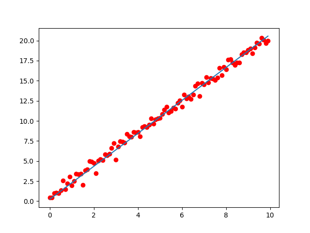

# Linear Regression

Data generated from function y = 2*x + 0.5 + noise:

```python
def generate_data(n, k, b, low=0.0, high=10.0):
    step = (high - low) / n
    x, y = [], []
    for i in range(n):
        x.append(low + step * i)
        y.append(x[i] * k + b + np.random.normal(0.0, 0.05 * (high - low)))
    return np.array(x), np.array(y)

x_train, y_train = generate_data(100, 2.0, 0.5)
```

The linear model:

```python
def model(_x, _theta):
    return _x * _theta[0] + _theta[1]
```

Gradient function:

```python
def gradient(_x, _y, _theta, _model):
    g = np.array([0.0, 0.0])
    for i in range(len(_x)):
        g[0] += (model(_x[i], _theta) - _y[i]) * _x[i]
        g[1] += (model(_x[i], _theta) - _y[i])
    return g
```

Training with gradient descent:

```python
def train(_x, _y, _theta, _model, lr=1e-5, steps=1000):
    for step in range(steps):
        _theta -= lr * gradient(_x, _y, _theta, _model)
        # print log
        if step % 100 == 0:
            print("step: %d, theta: %f %f, loss: %f" % (step, _theta[0], _theta[1], loss(_x, _y, _theta, _model)))
    return _theta
```

Result:
