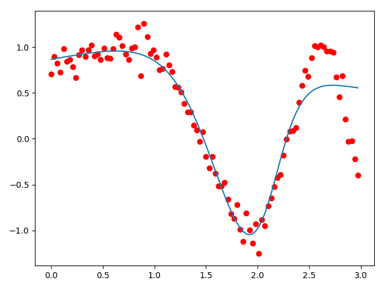

# Neural Network from scratch - Regression

Generate data from y = sin(x^2 +1) + noise:

```python
def generate_data(n, low=0.0, high=3.0):
    step = (high - low) / n
    x, y = [], []
    for i in range(n):
        x.append(low + step * i)
        y.append(sin(x[i] * x[i] + 1.) + np.random.normal(0.0, 0.1))
    return np.array(x), np.array(y)
```

The architecture of neural network two hidden layers with 50 and 5 neurons and sigmoid activation function:

```python
def sigmoid(_x):
    return 1. / (1. + np.exp(-_x))


def model(_x, _theta):
    """
    model architecture:
    input layer: m0 = 1
        theta["w1"]: (50, 1), theta["b1"]: (50, 1)
    hidden layer: m1 = 50, activation: sigmoid
        theta["w2"]: (5, 50), theta["b2"]: (5, 1)
    hidden layer: m2 = 5, activation: sigmoid
        theta["w3"]: (1, 5), theta["b3"]: (1, 1)
    output layer: m3 = 1
    """
    x0 = np.array(_x).reshape([1, 1])
    x1 = sigmoid(np.dot(_theta["w1"], x0) + _theta["b1"])
    x2 = sigmoid(np.dot(_theta["w2"], x1) + _theta["b2"])
    x3 = np.dot(_theta["w3"], x2) + _theta["b3"]
    return x0, x1, x2, x3
```

Back propagation for calculating the gradient vector:

```python
def gradient(_x, _y, _theta, _model):
    grad = {"w1": np.zeros((50, 1)), "b1": np.zeros((50, 1))
            , "w2": np.zeros((5, 50)), "b2": np.zeros((5, 1))
            , "w3": np.zeros((1, 5)), "b3": np.zeros((1, 1))}
    for i in range(len(_x)):
        x0, x1, x2, x3 = model(_x[i], _theta)
        # back propagation
        _loss_to_x3 = -2 * (np.array(_y[i]).reshape([1, 1]) - x3)
        grad["w3"] += np.dot(_loss_to_x3.T, x2.T)
        grad["b3"] += _loss_to_x3.T
        _x3_to_x2 = _theta["w3"]
        _x2_to_a2 = np.diag((x2 - x2 * x2).reshape([5, ]))
        _loss_to_a2 = _loss_to_x3.dot(_x3_to_x2).dot(_x2_to_a2)
        grad["w2"] += np.dot(_loss_to_a2.T, x1.T)
        grad["b2"] += _loss_to_a2.T
        _a2_to_x1 = _theta["w2"]
        _x1_to_a1 = np.diag((x1 - x1 * x1).reshape([50, ]))
        _loss_to_a1 = _loss_to_a2.dot(_a2_to_x1).dot(_x1_to_a1)
        grad["w1"] += np.dot(_loss_to_a1.T, x0.T)
        grad["b1"] += _loss_to_a1.T
    return grad
```

Resutlt:

