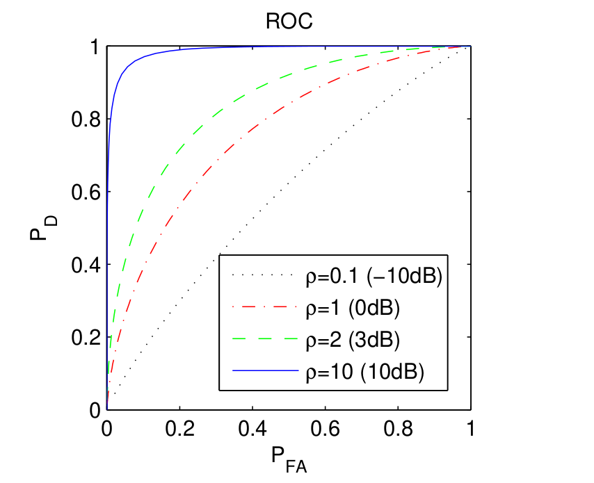
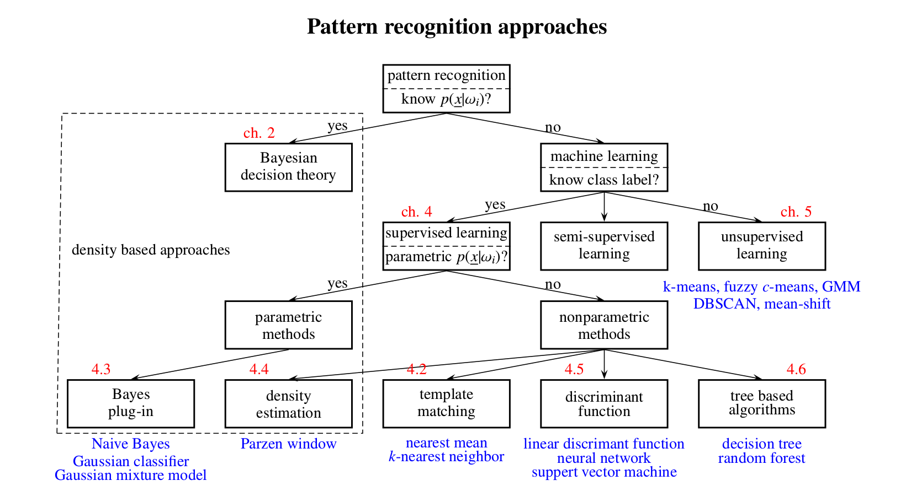

# Detection

## Precision and Recall

Precision = TP / (TP+FP)

Recall = TP / (TP+FN)

F-Score = 2/(1/P+1/R) (harmonic mean of P and R

**ROC Curve:** 

when moving the decision boundary to increase the detection rate, false alarm rate also increases. So the area under ROC curved to judge how good the model is. 

## Practical Challenge: Unknown Likelihood

To have d good detection model, a precise mathematical model for the likelihood is required. In many practical cases it is difficult, so learning based approach (Pattern Recognition) becomes a good alternative.

## Pattern recognition approaches

