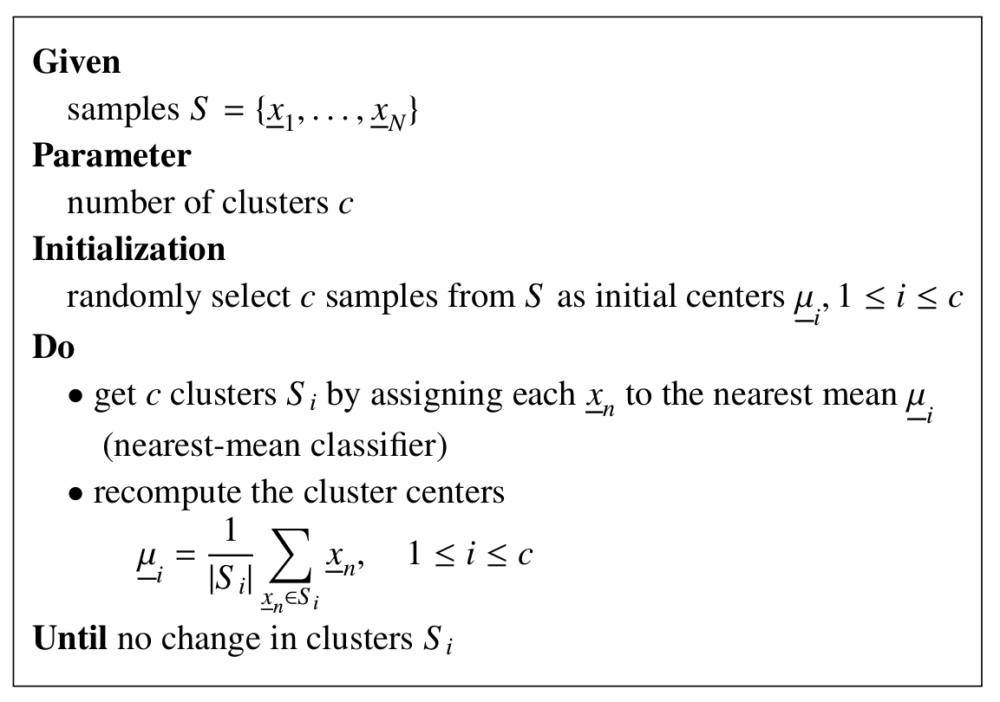

# Unsupervised Learning

## Clustering

**K-Means:** 

Note:

- multi-class clustering
- sensitive to the choice of the number of clusters c and the initial cluster centers

### Other methods:

- Fuzzy c-means
- mean-shift
- DBSCAN