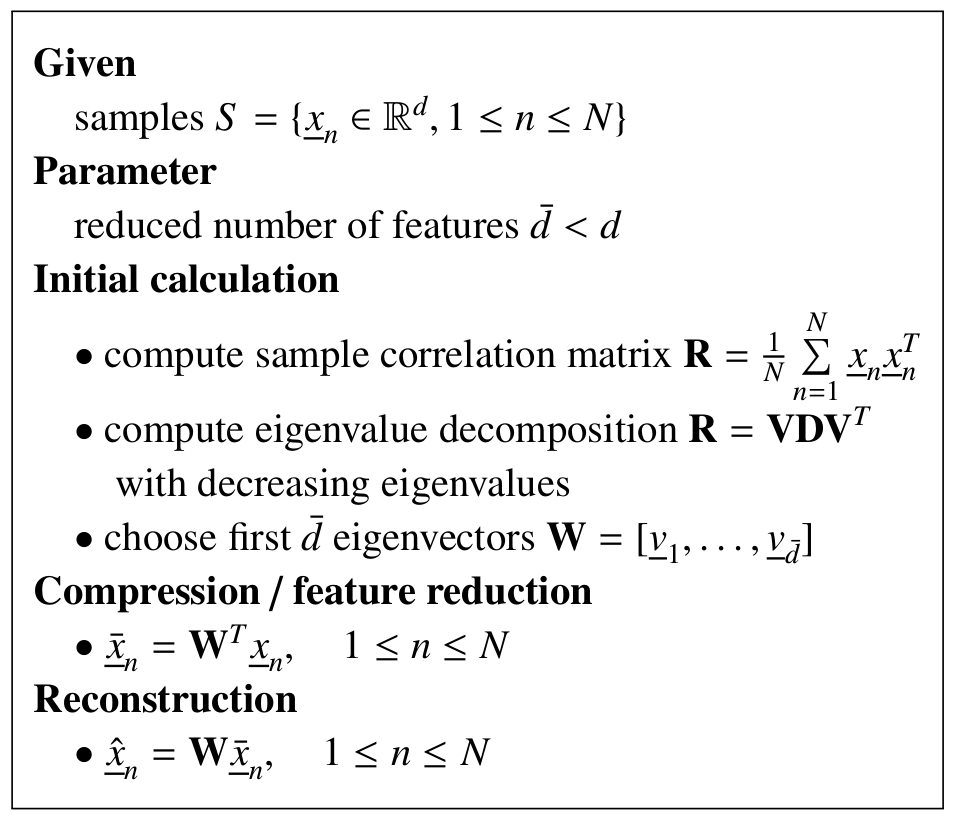

# Feature Dimension Reduction

Feature Selection:

- sequential floating forward selection (SFFS)

Feature Transform:

- principal component analysis (PCA)
- linear discriminant analysis (LDA)

### Principal Component Analysis

Note:

- powerful tool in data compression
- the optimum transform matrix W depends on signal itself