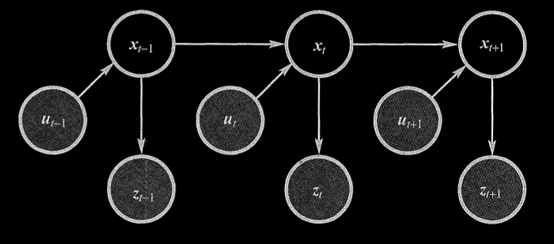

# Recursive State Estimation

## Conditional Independence

*x* and *y* are independent under the condition *z*:
$$
p(x,y|z) = p(x|z)p(y|z) \tag{2.17}
$$

which is equivalent to:
$$
\begin{cases} 
   p(x|z) = p(x|z,y) \tag{2.18-19}
\\ p(y|z) = p(y|z,x)
\end{cases}
$$ {/end}
**Proof**:

WLOG, insert (2.18) into (2.17) right side, get
$$
p(x|z,y)p(y|z) = \frac{p(x|z,y)p(y,z)}{p(z)} = \frac{p(x,y,z)}{p(z)} = p(x,y|z)
$$
however x and y are not necessarily independent, see book (2.20-21)

## Probabilistic Generative Laws

**Robot States**: x0, x1, ... , xt

**Environment Measurement**: z1, ... , zt

**Control data**: u1, ... , ut

(assume take action u first, than take measurement z)

If x is **complete**, then xt only depends on xt-1 and ut:
$$
p(x_t|x_{0:t-1},z_{1:t-1},u_{1:t}) = p(x_t|x_{t-1}, u_t) \tag{2.31}
$$
and zt depends only on xt:
$$
p(z_t|x_{0:t},z_{1:t-1},u_{1:t}) = p(z_t|x_t) \tag{2.32}
$$
(2.31) is called **state transition probability** and (2.32) is called **measurement probability**. They together form the **Hidden Markov Model**.

